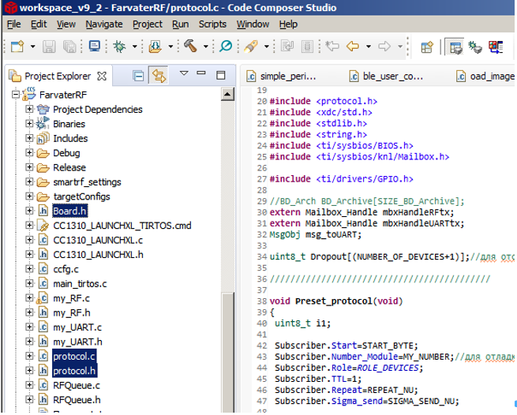

# Пошаговая инструкция по применению библиотеки сенсорной беспроводной сети в системах  сбора информации с распределенных по территории стационарных датчиков при использовании микроконтроллеров семейства TI CC13XX 

1. Разработанный протокол беспроводной сети, представленный в виде исходных кодов на языке программирования С может быть подключен к соответствующим проектам, работающим в микроконтроллерах, которые имеют в своем составе беспроводный приемопередатчик. Очевидно, что для отдельно взятого микроконтроллера существуют особые методы и средства работы с его приемопередатчиком. Кроме того, предполагается, что существует авторский алгоритм работы отдельного узла связи (микроконтроллера) в составе группы узлов связи. Предлагаемый алгоритм беспроводной сети позволяет обеспечить физический обмен сообщениями между узлами связи, не затрагивая логику работы авторского алгоритма, реализованного в узле связи. Поэтому вся обработка информации, связанная с формированием  обмена данными между элементами в технологии «Умный дом», «Умный город» и т.д. (датчики слежения за пожаром в труднодоступной местности, датчики качества работы протяженных объектов, трубопроводов, датчики мониторинга параметров окружающей среды, почвы) никак не связана с алгоритмом работы беспроводной сети связи и реализуется авторами проектов самостоятельно с учетом специфических требований к разрабатываемой системе, а предлагаемый алгоритм беспроводной связи, лишь обеспечивает доставку сообщений между узлами связи и остается неизменным при реализации вышеперечисленных задач.

2. Для использования библиотеки сенсорной сети в системах радиопередачи разработчик должен обладать необходимыми компетенциями для компиляции, запуска и отладки приложений в специфических для выбранных типов микроконтроллерах средах. Разработчик должен владеть навыками разработки радиотехнических систем, включая подключение, прошивку и контроль автономной работы встраиваемых автономных контроллеров и систем радиопередачи. Перечисленные вопросы не затрагиваются настоящей инструкцией, поскольку порядок использования конкретных аппаратных средств и сред разработки раскрыт в инструкциях и руководствах этих сред. 
В качестве примера применения библиотеки сенсорной беспроводной сети в системах сбора информации с распределенных по территории стационарных датчиков рассмотрим порядок действий при разработке и отладки программного обеспечения для микроконтроллера CC1310F128. При этом использовалась среды разработки Code Composer Studio (CCS) версии 9.3.0 и Software development kit (SDK) SimpleLink 13x0 версии 4.10.2.04 от Texas Instruments, работающие под операционной системой Windows. В проекте использовался компилятор версии TI v18.12.6.LTS и операционная система реального времени TI RTOS, в используемом SDK.  Для программирования и отладки микроконтроллера использовался программатор TI XDS110, который интегрирован в среду разработки CCS. 
В настоящем примере предполагается решение задачи доставки уведомления о срабатывании некоторого датчика (открыта дверь, появилась вода на полу, сработал датчик дыма и т.п.). При этом предполагается, что осуществляется односторонняя передача сообщений от узлов связи до сервера. Такие задачи возникают, например, при слежении за пожаром в труднодоступной местности, оценке качества работы протяженных объектов, трубопроводов, мониторинга параметров окружающей среды, почвы и т.п.

3. После установки и настройки всех вышеперечисленных программ необходимо импортировать проект `rfPacketTx_CC1310_LAUNCHXL_tirtos_ccs.projectspec` (типовой путь `C:\ti\simplelink_cc13x0_sdk_4_10_02_04\examples\rtos\CC1310_LAUNCHXL\drivers\rfPacketTx\tirtos\ccs\`), из папки примеров в SDK. Использование примеров от TI позволяет исключить ошибки при создании нового проекта и правильно настроить взаимодействие программы пользователя и операционной системы TI RTOS. После модернизации проекта под свои задачи (а они могут быть различными) необходимо добавить в проект протокол беспроводной сети.

4. В протоколе используются следующие функции:
- функция `void Preset_protocol(void);` - сброс в исходное состояние служебных параметров протокола.
- функция `void Package_processing(uint8_t* Received_packet, uint8_t len, int8_t last_rssi);` - обработка принятого пакета из радиоканала.
- функция `void Procedure_sending_packages(uint8_t** pBuf_sending_packages, uint8_t* pLen_sending_packages);` - формирование пакета для передачи по радиоканалу.
Работа протокола в беспроводном узле начинается с его инициализации с помощью команды `Preset_protocol()`. 
После приема пакета из радиоканала вызывается функция `Package_processing(uint8_t* Received_packet, uint8_t len, int8_t last_rssi)`, которая использует содержимое принятого пакета, его длину и уровень радиосигнала соответственно. 
Функция `Procedure_sending_packages(uint8_t** pBuf_sending_packages, uint8_t* pLen_sending_packages)` вызывается периодически, и возвращает указатель на пакет (и его длину), который должен быть передан по радиоканалу. Если длина пакета равна нулю, то передача пакета не требуется. Период вызова функции определяется выбранной пользователем скоростью передачи информации по радиоканалу. Период не должен быть менее, чем время отправки самого длинного пакета.
    
5. В проект включаются файлы Board.h, protocol.h и protocol.c. В файле Board.h  для каждого радиоузла указывается его уникальный адрес `#define MY_NUMBER 0x0b`. Если радиоузел назначается сервером, то его номер должен быть 0x01. Пример представлен на следующем рисунке. 

 
Ниже показан принцип организации взаимодействия основной программы и протокола беспроводной сети.

6. Основная программа и протокол беспроводной сети реализован в виде отдельных задач, работающих под управлением операционной системы. Для обмена данными между задачами необходимо использовать метод mailbox из TI RTOS. В основной программе нужно объявить структуры и идентификаторы метода mailbox следующим образом:
`Mailbox_Struct mbxStructUARTtx;` // для передачи данных в интерфейс uart
`Mailbox_Handle mbxHandleUARTtx;`
`Mailbox_Struct mbxStructRFrx;` // для приема данных из радиоканала
`Mailbox_Handle mbxHandleRFrx;`
`Mailbox_Struct mbxStructRFtx;` // для передачи данный в радиоканал
`Mailbox_Handle mbxHandleRFtx;`

7. При организации беспроводного обмена данными необходимо использовать две задачи: "workUART" и "workRF", связанных с обслуживанием интерфейса uart и приемопередатчика.

### Задача "workUART"
Способ реализации задачи обслуживания интерфейса uart не имеет особого значения. Способ решает две задачи: принять данные из uart и передать их в модуль protocol.c, а также принять данные из модуля protocol.c и передать их в uart. Для решения первой задачи используется mailbox с идентификатором mbxHandleRFtx, в котором содержатся принятые данные и их длина. Для решения второй задачи используется mailbox с идентификатором mbxHandleUARTtx, в котором содержатся данные и их длина, которые следует передать в uart.

### Задача "workRF"

`Модуль protocol.c` является частью задачи "workRF". В задаче, связанной с обслуживанием приемопередатчика, перед инициализацией радиоканала в CC1310 выполняются предустановки протокола: вызывается функция `Preset_protocol()`, после чего инициализируется и разрешается работа приемопередатчика. 

8. При получении сообщения из радиоканала посредством TI RTOS используется функция rxrfcallback, в которой заполняется структура currentDataEntry, которая содержит принятые данные, их длину и уровень сигнала. Далее, все эти параметры передаются в функции Package_processing в protocol.c. В примере ниже представлен процесс обработки принятого сообщения. 

```C++
void rxrfcallback(RF_Handle h, RF_CmdHandle ch, RF_EventMask e)
{
 pHPacket pInputPacket;
 if(e & RF_EventRxEntryDone)
 {
  GPIO_toggle(Board_GPIO_LED_RX);
  do
  {
  /* Get current unhandled data entry */
   currentDataEntry = RFQueue_getDataEntry();

   /* Handle the packet data, located at &currentDataEntry->data:
    * - Length is the first byte with the current configuration
    * - Data starts from the second byte */
   //*(uint8_t*)(&currentDataEntry->data) - длина пакета
   pInputPacket=(pHPacket)(&currentDataEntry->data+1);
   if((pInputPacket->Start==START_BYTE) && ((*(uint8_t*)(&currentDataEntry->data + (*(uint8_t*)(&currentDataEntry->data))))==STOP_BYTE) && (pInputPacket->TTL!=0) && ((*(uint8_t*)(&currentDataEntry->data))<=PACKET_SIZE_MAX))
   {//Пришел пакет
    Package_processing((uint8_t*)(&currentDataEntry->data + 1), *(uint8_t*)(&currentDataEntry->data), rxStatistics.lastRssi); //на обработку
   }

  } while(RFQueue_nextEntry()==DATA_ENTRY_FINISHED);
 }
}
```
9. В задаче "workRF" необходимо периодически (период не должен быть меньше времени передачи по радиоканалу самого длинного сообщения) вызывать функцию Procedure_sending_packages так как показано ниже.
 
```C++
   //проверяем буффер вывода в RF
    len_sending_packages=0;
    Procedure_sending_packages(&pBuf_sending_packages, &len_sending_packages);
    if((len_sending_packages) && (len_sending_packages<=PACKET_SIZE_MAX))
    {
     //есть, что выводить в радио
     abortGraceful = 0;
     RF_cancelCmd(rfHandle, rfRxCmdHandle, abortGraceful);

     // Send packet
     msg_RF.len=len_sending_packages;
     memcpy(msg_RF.buf, pBuf_sending_packages, msg_RF.len);
     RF_cmdPropTx.pktLen=msg_RF.len;
     RF_cmdPropTx.pPkt=msg_RF.buf;
     RF_CmdHandle result = RF_postCmd(rfHandle, (RF_Op*)&RF_cmdPropTx, RF_PriorityNormal, &txrfcallback, RF_EventCmdDone);
     continue;
    }
```
Если длина сообщения не равна нулю, то согласно работе протокола (файл protocol.c) требуется выполнить передачу сообщения по радиоканалу.

10. Для того использования интерфейса uart в модуле protocol.c необходимо объявить два идентификатора mailbox:
`extern Mailbox_Handle mbxHandleRFtx;` // данные в радиоканал
`extern Mailbox_Handle mbxHandleUARTtx;` // данные в интерфейс uart

11. В периодически вызываемой функции Procedure_sending_packages будет автоматически проверяться наличие данных из интерфейса uart, и если они есть, то выполняется заполнение буфера пользовательских данных. Далее выполняется проверка состояние контрольного вывода с именем Board_DET_ALARM, если его состояние соответствует нулю, то выполняется отправка на сервер сообщения обнаружения аварии в пакете PacketBuf[INDX_PCT_BUF_0].buf.
```C++
void Procedure_sending_packages(uint8_t** pBuf_sending_packages, uint8_t* pLen_sending_packages)
{
...
//Состояние приема ответов от новых устройств в Level+1
case STAGE_RECEIVING_MESSAGES_FROM_NEW_DEVISES_LEVEL_PLUS:
   if(Statistics.time_Stage>Statistics.time_Stage_limit)
   { 
    pBuf=(pHPacket)&PacketBuf[INDX_PCT_BUF_0].buf;//ячейка для нуль пакета в буфере передачи

...

    if(!GPIO_read(Board_DET_ALARM))//добавляем данные вниз в команде 2 если авария
    {
     PacketBuf[INDX_PCT_BUF_0].buf[(PacketBuf[INDX_PCT_BUF_0].len-1)]=0x01; //признак превоги
     PacketBuf[INDX_PCT_BUF_0].len+=1;
     if(DataDown.repeat!=0) DataDown.repeat--;
    }
  
    PacketBuf[INDX_PCT_BUF_0].buf[(PacketBuf[INDX_PCT_BUF_0].len-1)]=STOP_BYTE;
    PacketBuf[INDX_PCT_BUF_0].time_delta_for_send=0;//время перед отправкой пакета
    PacketBuf[INDX_PCT_BUF_0].time_tmp=0;
```

12. Реализация перечисленных действий позволит пользовательскому программному обеспечению радиомодуля производить обмен произвольной информацией (например, результатам измерения, данными телеметрии) друг с другом, используя в автоматическом режиме промежуточные радиоузлы.
