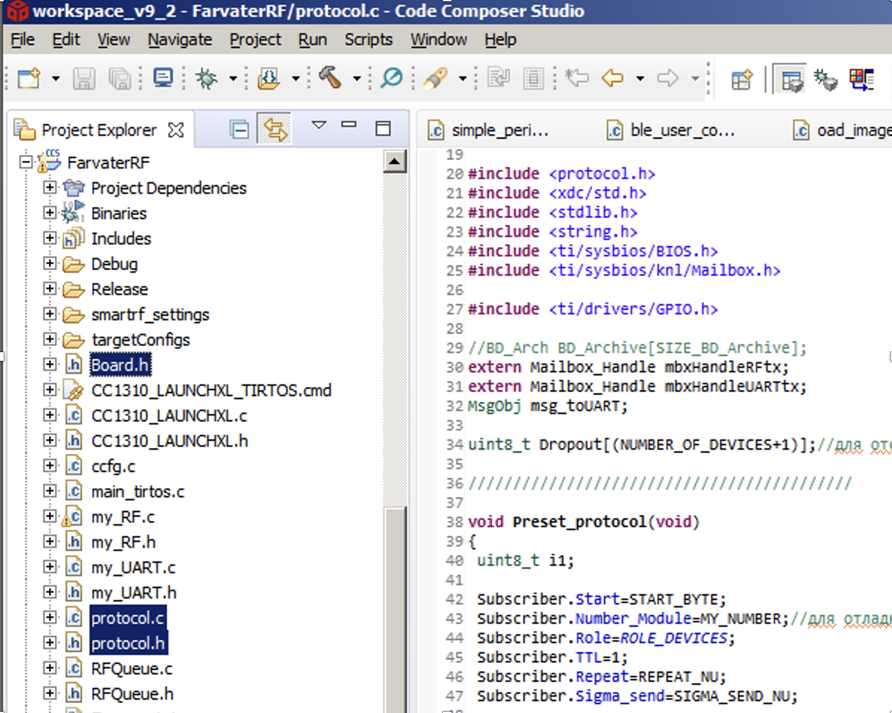

# Прошивка радиомодуля сенсорной сети

Открытая библиотека по модулированию и организации работы сенсорной сети с подвижными элементами состоит из двух основных блоков, позволяющих выполнять  имитацию беспроводной среды передачи и формировать протокола самоорганизующейся беспроводной сенсорной сети.

Имитатор беспроводной среды передачи обеспечивает доставку сообщений до беспроводных узлов, находящихся в заданном радиусе действия передатчика, а также обнаружение коллизий.
Протокол самоорганизующейся беспроводной сенсорной сети реализован в виде отдельного класса, что позволяет создавать множество независимых беспроводных узлов, работающих автономно в рамках общей беспроводной сенсорной сети.

Имитатор беспроводной среды передачи реализован в виде библиотеки areaRF.o, которая работает по двухтактной схеме, на первом такте осуществляется: 
* прием сообщений от активных беспроводных узлов; 
* обнаружение беспроводных узлов, попадающих в радиус действия всех принятых сообщений;
* обнаружение беспроводных узлов, попадающих в радиус одновременного  действия двух или более принятых сообщений, т.е. обнаружение коллизий.

На втором такте осуществляется передача сообщений на беспроводные узлы, находящиеся в радиусе действия и для которых отсутствуют коллизии. 

Протокол самоорганизующейся беспроводной сенсорной сети реализован в виде библиотеки protocol.o. Протокол на каждом беспроводном узле работает автономно и требует лишь уникального адреса беспроводного узла. 

Для реализации процедуры моделирования работы выше обозначенных программных модулей в описание каждого беспроводного узла требуется добавить описание его положения. В настоящее время используется двумерная система координат, которая может быть расширена и на трехмерное пространство.

1.2. Описание библиотеки areaRF.o
1.2.1. Подключение библиотеки в среде программирования Python
areaRF = ctypes.CDLL('./objs/areaRF.o')
1.2.2. Размещение беспроводных узлов (принимает аргумент void * (netInit *))
areaRF.NewPlacementInit.argtypes = [ctypes.c_void_p]
Используется структура 
```C
class netInit(ctypes.Structure):
_fields_ = [('MyNumber', ctypes.c_uint8),
        ('Xcoo', ctypes.c_uint8),
        ('Ycoo', ctypes.c_uint8),
        ('NunmberOfDevices', ctypes.c_uint8),
        ('DistanceLimit', ctypes.c_uint16),
        ('CounterRepeat', ctypes.c_uint8)]
```
где MyNumber, Xcoo и Ycoo – номер беспроводного узла, и его начальные координаты соответственно, NunmberOfDevices – количество беспроводных узлов в сенсорной сети, DistanceLimit – максимальная дальность связи, CounterRepeat – резерв. 
В результате происходит присвоение номеров беспроводным узлам и размещение заданного количества беспроводных узлов на некоторой территории.

1.2.3. Обработчик входных сообщений в areaRF от беспроводных узлов
areaRF.areaRFrx.argtypes = [ctypes.c_void_p]
Обработчик принимает аргумент void * (peport *)

```C
class peport(ctypes.Structure):
_fields_ = [('len', ctypes.c_uint8),
                  ('Xcoo', ctypes.c_uint8),
                  ('Ycoo', ctypes.c_uint8),
                 ('Source', ctypes.c_uint8),
                 ('packet', ctypes.c_char_p)]
```
где len – длина принятого сообщения, Xcoo, Ycoo и Source – текущие координаты и номер беспроводного узла соответственно, packet – передаваемое сообщение.

В результата обеспечивается прием и сохранение в буфере всех сообщений, переданных беспроводными узлами в текущий такт имитации работы сенсорной сети.

1.2.4. Инициализация второго такта. Результат возвращается в виде списка всех сообщений, доступных на втором такте работы имитатор беспроводной среды. Сообщения, содержат признак наличия/отсутствия коллизии. Результат возвращается в виде списка в формате uint8 *.
```C
areaRF.Timer_trigger.restype = ctypes.c_char_p
```

В списке помечаются сообщения, которые не могут быть приняты в данной точке приема.

1.2.5. Вычитывание всех сообщений, доступных данному беспроводному узлу с учетом его дальности до передающего беспроводного узла и отсутствия коллизий. Результат возвращается в формате peport *.
areaRF.areaRFtx.restype = ctypes.POINTER(peport)
    В результате конкретный беспроводной узел получает только те сообщения, которые не подвержены коллизии и которые имеют допустимую мощность приема.

1.3. Описание библиотеки protocol.o
1.3.1. Подключение библиотеки в среде программирования Python
```python
protocol = ctypes.CDLL('./objs/protocol.o')
```

# Примеры новых вариантов использования кода
Разработанный код может применяться в рамках:
1. Обмена данными между элементами в технологии «Умный дом», «Умный город» и т.д.
2. Сбора информации с распределенных по территории стационарных датчиков (датчики слежения за пожаром в труднодоступной местности, датчики качества работы протяженных объектов, трубопроводов, датчики мониторинга параметров окружающей среды, почвы).
3. Обмена данными между подвижными объектами, выполняющими специальные задачи в рамках единой группы.

------------
## Описание и порядок использования библиотек в системе сбора информации с распределенных по территории стационарных датчиков
После компиляции библиотеки становятся составной частью прошивки радиомодулей, обеспечивающих передачу информации. 

Сама открытая библиотека состоит из трех файлов: `Board.h`, `protocol.c`, `protocol.h`. Все файлы соответствуют стандартам языка программирования C.

Файл Board.h содержит предопределенные константы и структуры, используемые в протоколе.
Используемые функции:
* функция `void Preset_protocol(void);` - сброс в исходное состояние служебных параметров протокола.
* функция `void Package_processing(uint8_t* Received_packet, uint8_t len, int8_t last_rssi);` - обработка принятого пакета из радиоканала.
* функция `void Procedure_sending_packages(uint8_t** pBuf_sending_packages, uint8_t* pLen_sending_packages);` - формирование пакета для передачи по радиоканалу.
  
Работа протокола в беспроводном узле начинается с его инициализации с помощью команды `Preset_protocol()`. 

После приема пакета из радиоканала вызывается функция `Package_processing(uint8_t* Received_packet, uint8_t len, int8_t last_rssi)`, которая использует содержимое принятого пакета, его длину и уровень радиосигнала соответственно. 

Функция `Procedure_sending_packages(uint8_t** pBuf_sending_packages, uint8_t* pLen_sending_packages)` вызывается периодически, и возвращает указатель на пакет (и его длину), который должен быть передан по радиоканалу. Если длина пакета равна нулю, то передача пакета не требуется. Период вызова функции определяется выбранной пользователем скоростью передачи информации по радиоканалу. Период не должен быть менее, чем время отправки самого длинного пакета.

Приведем частный пример интеграции описанных выше модулей в микроконтроллер CC1310, в котором предполагается, что обмен пользовательскими данные с периферийными устройствами осуществляется по интерфейсу uart, а сервер выполняет передачу данных на узлы связи и прием от них ответных сообщений. 

При создании проекта используется операционная система реального времени TI TROS, которая позволяет реализовать многозадачные приложения. Проект разрабатывается в среде Code Composer Studio.
В проект включаются файлы `Board.h`, `protocol.h` и `protocol.c`. В файле `Board.h`  для каждого радиоузла указывается его уникальный адрес `#define MY_NUMBER 0x0b`. Если радиоузел назначается сервером, то его номер должен быть `0x01`.

 

Для обмена данными между задачами используется метод `mailbox` из `TI RTOS`. В основной программе объявляются структуры и идентификаторы метода mailbox:
```C++
Mailbox_Struct mbxStructUARTtx; // для передачи данных в интерфейс uart
Mailbox_Handle mbxHandleUARTtx;
Mailbox_Struct mbxStructRFrx; // для приема данных из радиоканала
Mailbox_Handle mbxHandleRFrx;
Mailbox_Struct mbxStructRFtx; // для передачи данный в радиоканал
Mailbox_Handle mbxHandleRFtx;
```
В проекте используются две задачи: "workUART" и "workRF", связанных с обслуживанием интерфейса uart и приемопередатчика.

### Задача "workUART".
Способ реализации задачи обслуживания интерфейса uart не имеет особого значения. Способ решает две задачи: принять данные из uart и передать их в модуль protocol.c, а также принять данные из модуля protocol.c и передать их в uart. Для решения первой задачи используется mailbox с идентификатором mbxHandleRFtx, в котором содержатся принятые данные и их длина. Для решения второй задачи используется mailbox с идентификатором mbxHandleUARTtx, в котором содержатся данные и их длина, которые следует передать в uart.

### Задача "workRF".
Модуль `protocol.c` является частью задачи `workRF`. В задаче, связанной с обслуживанием приемопередатчика, перед инициализацией радиоканала в CC1310 выполняются предустановки протокола: вызывается функция `Preset_protocol()`, после чего инициализируется и разрешается работа приемопередатчика. 
При получении сообщения из радиоканала посредством TI RTOS срабатывает функция `rxrfcallback`, в которой заполняется структура currentDataEntry, которая содержит принятые данные, их длину и уровень сигнала. Далее, все эти параметры передаются в функции `Package_processing` в `protocol.c` 

```C++
void rxrfcallback(RF_Handle h, RF_CmdHandle ch, RF_EventMask e)
{
 pHPacket pInputPacket;
 if(e & RF_EventRxEntryDone)
 {
  GPIO_toggle(Board_GPIO_LED_RX);
  do
  {
  /* Get current unhandled data entry */
   currentDataEntry = RFQueue_getDataEntry();

   /* Handle the packet data, located at &currentDataEntry->data:
    * - Length is the first byte with the current configuration
    * - Data starts from the second byte */
   //*(uint8_t*)(&currentDataEntry->data) - длина пакета
   pInputPacket=(pHPacket)(&currentDataEntry->data+1);
   if((pInputPacket->Start==START_BYTE) && ((*(uint8_t*)(&currentDataEntry->data + (*(uint8_t*)(&currentDataEntry->data))))==STOP_BYTE) && (pInputPacket->TTL!=0) && ((*(uint8_t*)(&currentDataEntry->data))<=PACKET_SIZE_MAX))
   {//Пришел пакет
    Package_processing((uint8_t*)(&currentDataEntry->data + 1), *(uint8_t*)(&currentDataEntry->data), rxStatistics.lastRssi); //на обработку
   }

  } while(RFQueue_nextEntry()==DATA_ENTRY_FINISHED);
 }
}

```
 
В задаче "workRF", периодически (период не должен быть меньше времени передачи по радиоканалу самого длинного сообщения) вызывается функция Procedure_sending_packages 
 
 ```C++

    //проверяем буффер вывода в RF
     len_sending_packages=0;
     Procedure_sending_packages(&pBuf_sending_packages, &len_sending_packages);
     if((len_sending_packages) && (len_sending_packages<=PACKET_SIZE_MAX))
     {
      //есть, что выводить в радио
      abortGraceful = 0;
      RF_cancelCmd(rfHandle, rfRxCmdHandle, abortGraceful);
 
      // Send packet
      msg_RF.len=len_sending_packages;
      memcpy(msg_RF.buf, pBuf_sending_packages, msg_RF.len);
      RF_cmdPropTx.pktLen=msg_RF.len;
      RF_cmdPropTx.pPkt=msg_RF.buf;
      RF_CmdHandle result = RF_postCmd(rfHandle, (RF_Op*)&RF_cmdPropTx, RF_PriorityNormal, &txrfcallback, RF_EventCmdDone);
      continue;
     }
 
 ```

Если длина сообщения не равна нулю, то согласно работе протокола (файл protocol.c) требуется выполнить передачу сообщения по радиоканалу.
    Таким образом, показан принцип интеграции протокола в основной код программы. 
Для того чтобы иметь возможность обмениваться пользовательскими данными был использован интерфейс uart. Поэтому в модуле protocol.c объявлены два идентификатора mailbox:

```C++
extern Mailbox_Handle mbxHandleRFtx; // данные в радиоканал
extern Mailbox_Handle mbxHandleUARTtx; // данные в интерфейс uart
```

В периодически вызываемой функции Procedure_sending_packages проверяется наличие данных из интерфейса uart, и если они есть то выполняется заполнение буфера пользовательских данных.

 ```C++

 void Procedure_sending_packages(uint8_t** pBuf_sending_packages, uint8_t* pLen_sending_packages)
 {
 
  if(Mailbox_pend(mbxHandleRFtx, &msg_uart, BIOS_NO_WAIT))
  {
   //заполняем буфер пользовательских данных данными из uart
 
   if(msg_uart.len<(PACKET_SIZE_MAX-(sizeof(HPacket)+1)))
   {
    if(Subscriber.Number_Module==1)
    {
     DataUp.len=msg_uart.len+1;//+номер сессии
     memcpy(DataUp.buf, msg_uart.buf, DataUp.len);
     DataUp.buf[msg_uart.len]=DataUp.session;
     DataUp.repeat=DATA_REPEAT_UP_DOWN;//количество повторов отправки пользовательских данных вверх
     DataUp.session++;
    }
 
 ```

Ниже показан пример выделения в функции Package_processing из принятого сообщения пользовательских данных и передача их в интерфейс uart.

 ```C++
 if(PacketReceiv.len>(1+sizeof(HPacket)))
 {
  DataUp.len=PacketReceiv.len-1-sizeof(HPacket);
  memcpy(DataUp.buf, &PacketReceiv.buf[sizeof(HPacket)], DataUp.len);
  DataUp.repeat=1;
 
  if(Dropout[0]!=DataUp.buf[DataUp.len-1])
  {
   //такие польз. данные еще в uart не отправляли. Номера сессий не совпадают
   msg_toUART.len=DataUp.len-1;
   Dropout[0]=DataUp.buf[msg_toUART.len];//фиксируем текущий номер сессии от Сервера
   memcpy(msg_toUART.buf, DataUp.buf, msg_toUART.len);
   Mailbox_post(mbxHandleUARTtx, &msg_toUART, BIOS_NO_WAIT);//передаем в uart пользовательские данные
  }
 }
 
 ```

Приведенная выше реализация позволяет полностью обеспечить организацию радиоканала между территориально распределенными устройствами для передачи телеметрической информации без использования дополнительного кода. 
