Описание обучения моделей на основе YOLOv8
=============

[YOLOv8](https://github.com/ultralytics/ultralytics) представляет собой высокоэффективную модель обнаружения объектов
в реальном времени. Основанная на концепции однократного анализа
изображения, модель YOLOv8 способна одновременно выявлять и
классифицировать объекты на изображении, обеспечивая быстроту и точность в процессе обнаружения.

# Решаемые задачи

Когда речь идет о методах YOLO, можно выделить два основных направления:

Object Detection - это метод определения объектов на изображении или кадре, где алгоритм или нейронная сеть обнаруживают объекты и записывают их позицию с помощью ограничивающих рамок (bounding boxes). Этот алгоритм работает с отдельными изображениями, позволяя точно определить объекты на них (Рис.1).

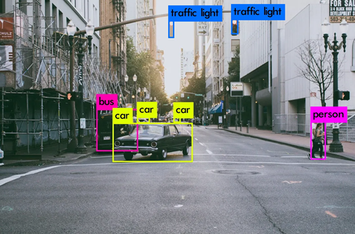

Рисунок 1. Object Detection

Object Tracking - это метод, который включает в себя не только Object Detection, но и обнаружение и отслеживание объектов в непрерывном потоке изображений. Он позволяет понять, какой объект на новом кадре соответствует объекту на предыдущем кадре. Таким образом, Object Tracking использует результаты Object Detection для установления и поддержания связи между объектами во времени и прослеживания их перемещения на последующих кадрах (Рис. 2).

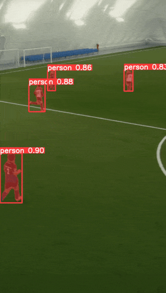

Рисунок 2. Object Tracking

## Архитектура YOLO и ее сравнение с другими моделями

Существуют различные архитектуры нейронных сетей, предназначенных для задачи определения объектов. Их можно классифицировать на две основные категории: \"двухуровневые\" сети, такие как RCNN, fast RCNN и faster
RCNN, и \"одноуровневые\" сети, включая YOLO.

\"Двухуровневые\" сети, упомянутые выше, используют метод регионов на изображении для определения присутствия объектов в этих регионах. Для примера рассмотрим процесс для faster RCNN, которая считается наиболее быстрой из описанных двухуровневых систем (Рис.3):

1\. Входное изображение или кадр подается на вход нейронной сети.
2\. Кадр проходит через сверточную нейронную сеть (CNN) для создания карт признаков (feature maps).
3\. С помощью отдельной нейронной сети генерируются области интереса, в которых может находится объект.
4\. Выполняется преобразование вектора признаков области интереса
(произвольного прямоугольника) из исходного изображения в вектор
признаков фиксированной размерности, с помощью слоя RoI pooling.

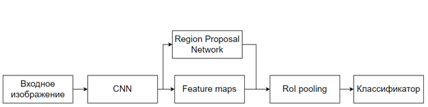

Рисунок 3. Архитектура «двухуровневых» сетей

Данное решение имеет два недостатка. Во-первых, модель основывается на рассмотрении отдельных регионов, а не всего изображения в целом. Во-вторых, является относительно медленным способом определения объектов.

Архитектура YOLO не обладает указанными недостатками. Она относится к категории детекторов \"one stage\", которая в отличие от «двухуровневых», представляет собой единую сверточную сеть, которая состоит из сверточного слоя и двух полностью связанных слоев и одновременно прогнозирует положение и категорию ограничивающего
прямоугольника (Рис. 4).

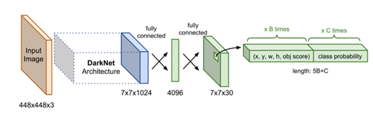

Рисунок 4. Общая архитектура YOLO

## Алгоритм работы YOLO

Основной алгоритм работы YOLO представлен в следующих этапах (Рис. 5):

1\. Изображение на входе попадает на базовую сверточную нейронную сеть, которая классифицирует входные изображения. На полученное
изображение накладывается сетка размером S × S. Ячейка, в которую
попадает центр объекта будет указывать на предварительное обнаружение
этого объекта. Каждая ячейка предсказывает показатель достоверности,
местоположение ограничивающих рамок и вероятность класса объекта, при
условии попадания объекта в ограничивающую рамку, обычно это квадрат
или прямоугольник.

2\. Величина достоверности показывает вероятность того, что ячейка
содержит объект. Эта величина умножается на его IoU. IoU -- это
степень пересечения областей на изображении. Эта величина используется
для определения процента перекрытия истинной области объекта,
предсказанной областью.

3\. Прогноз класса объекта: Для каждого bounding box модель также
предсказывает вероятности принадлежности к определенным классам
объектов. Используется многоклассовая классификация, где каждый класс
имеет свою вероятность.

4\. Применение порога обнаружения: Для повышения точности и устранения
ложных срабатываний применяется пороговое значение (threshold),
которое определяет минимальную вероятность, при которой объект
считается обнаруженным.

5\. Подавление нескольких обнаружений: Используя алгоритм подавления
нескольких обнаружений (non-max suppression), модель удаляет
дублирующиеся bounding boxes, оставляя только наиболее вероятные
исходя из перекрытия и вероятности класса.

6\. Вывод результатов: Итоговые bounding boxes с классами объектов
считаются окончательным результатом алгоритма. Они представляют
обнаруженные объекты и их положение на исходном изображении.

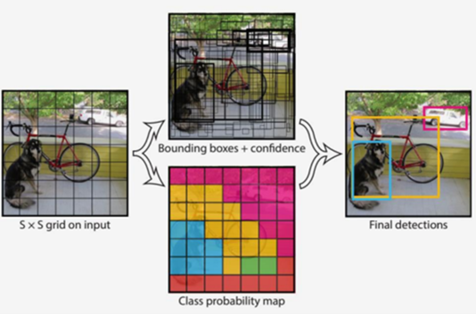

Рисунок 5. Общий алгоритм работы YOLO

## Требования к обучающей выборке

Для обучения модели YOLO необходимо, чтобы набор данных удовлетворял
требованиям этой модели, позволяя ей эффективно и быстро определять
сельскохозяйственные поля на изображениях. Для этого следует обращать
внимание на следующие требования:

-   Разнообразие примеров: Обучающая выборка должна содержать множество
    разнообразных примеров, которые представляют различные сценарии.
    Например, объекты, которые должны быть определены моделью, должны
    быть представлены на изображениях в разных масштабах, под разными
    углами и в различных условиях освещения. Разнообразие примеров
    помогает модели обобщать и делать точные предсказания на новых
    данных.

-   Качество разметки: Важно, чтобы обучающая выборка была точно
    размечена, то есть каждый пример должен иметь правильную метку.
    Разметка должна быть надежной и достоверной, чтобы модель могла
    извлекать правильные закономерности из данных. Неправильная или
    неточная разметка может привести к низкому качеству модели и
    плохой производительности.

-   Объем данных: Чтобы создать надежную модель, обучающая выборка
    должна быть достаточно большой. Количество примеров может
    варьироваться в зависимости от сложности задачи и архитектуры
    модели, но в целом больше данных обеспечивают лучшую способность
    модели к обобщению.

-   Качество данных: Данные в обучающей выборке должны быть высокого
    качества и не содержать артефактов или искажений, которые могут
    помешать модели извлекать полезные признаки. Предварительная
    обработка данных, такая как удаление шума или исправление
    искажений, может быть полезной для улучшения качества данных.

-   Репрезентативность данных: Данные должны быть собраны из схожих
    условий и источников, с которыми модель будет взаимодействовать
    после обучения. Это помогает модели быть более репрезентативной и
    лучше работать на новых данных, которые могут иметь схожие
    характеристики.

## Постановка задачи на обучение

В контексте предстоящего обучения принимается во внимание набор данных,
состоящий из 140 изображений транспортного средства, передвигающийся по
сельскохозяйственным полям в различных метеорологических условиях.
Основной целью является обучение модели, способной осуществлять
распознавание сельскохозяйственных полей. Для достижения этой цели
используется модель для распознавания и сегментации объектов, а именно
YOLOv8.

Важно отметить, что в рамках обучения не будет рассматриваться процесс
установки YOLOv8. Подробную информацию об установке можно найти по
следующей ссылке: https://github.com/ultralytics/ultralytics.

## Подготовка датасета к обучению

Ключевым аспектом успешного обучения модели в компьютерном зрении
является тщательная разметка набора данных. Точность и эффективность
будущих предсказаний модели напрямую зависят от четкости и правильности
размеченных объектов в обучающем наборе. Каждый объект требует точной
ограничивающей рамки, которая дает модели ясное представление о его
местоположении на изображении. Чем более аккуратно произведена разметка,
тем лучше модель сможет обучиться выявлять и классифицировать объекты.
Этот этап играет критическую роль в формировании качественной базы
данных, обеспечивая точность и надежность работы модели при последующем
прогнозировании. Таким образом, правильная разметка данных является
фундаментальным шагом в обучении моделей компьютерного зрения,
существенно влияя на результаты их работы.

## Настройка проекта на Платформе CVAT

Для обучения нашей модели YOLOv8 необходимо провести разметку набора
изображений, который будет использоваться для тренировки и валидации.
Прежде всего, следует посетить веб-сайт https://app.cvat.ai/.
Произведите регистрацию, последовав инструкциям на сайте.

Затем создайте новый проект, нажав на кнопку \"+\" и выбрав \"Create a
new project\" (Рис. 6).

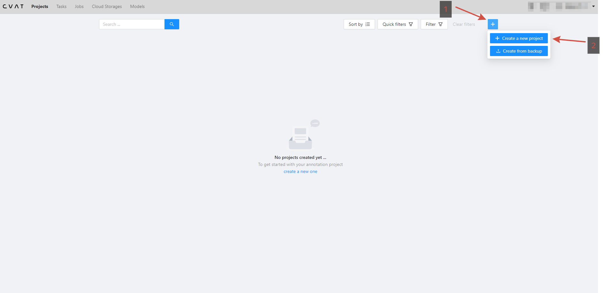

Рисунок 6. Создание проекта

Задайте название проекта и определите метки, которые будут
использоваться для идентификации объектов с помощью кнопки \"Add
label\". В рамках обучения выбираем единственную метку -
\"сельскохозяйственные поля\" (fields). Далее нажмите \"Submit & Open\"
для продолжения настройки (Рис. 7).

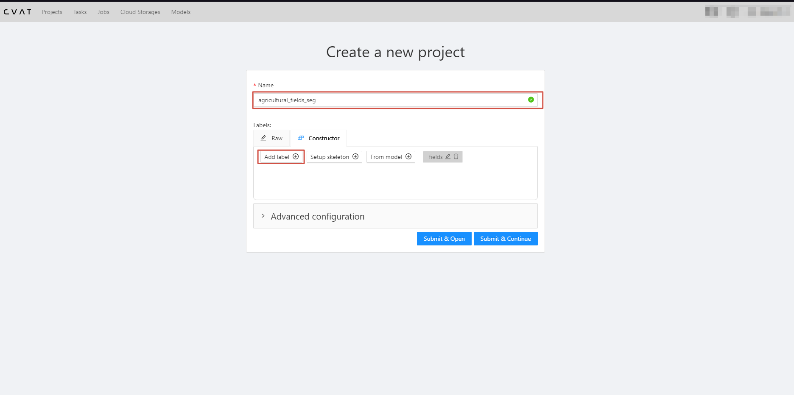

Рисунок 7. Добавление названий меток

Теперь необходимо создать задачу, нажав "+" -\"Create a new task"(Рис.
8). 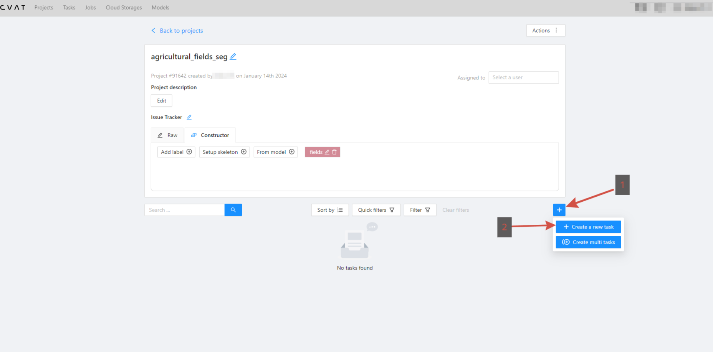{width="6.722916666666666in"
height="3.316788057742782in"}

Рисунок 8. Создание задачи

Укажите название и загрузите изображения из набора данных. После этого
снова нажмите \"Submit & Open\" (Рис. 9).

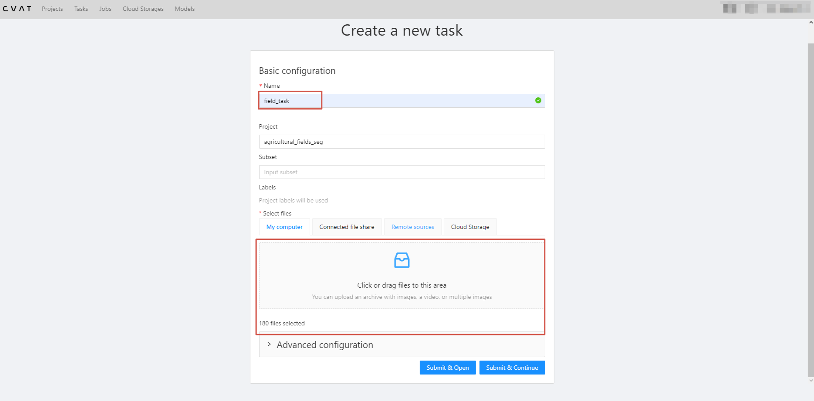

Рисунок 9. Окно создания задачи

После создания задачи перейдите к ней и начните процесс разметки
изображений (Рис.10).

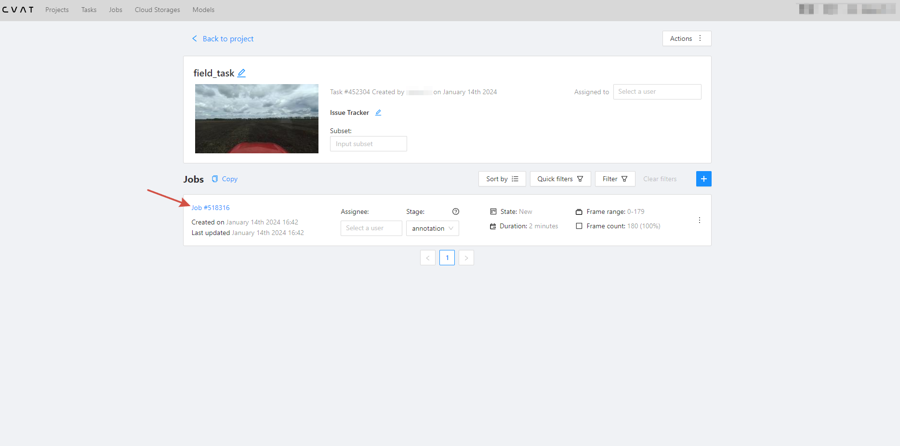

Рисунок 10. Обзор задачи

## Разметка изображений

Инструменты для разметки расположены слева в
приложении. В верхней части представлен удобный интерфейс для перехода
между изображениями. Справа находятся размеченные объекты на
текущем изображении. Посредине представлено изображение, которое
требуется подвергнуть разметке. Интерфейс приложения является интуитивно
понятным и доступным для понимания (Рис. 11). В качестве примера будут
использованы кривые прямые
(polyline).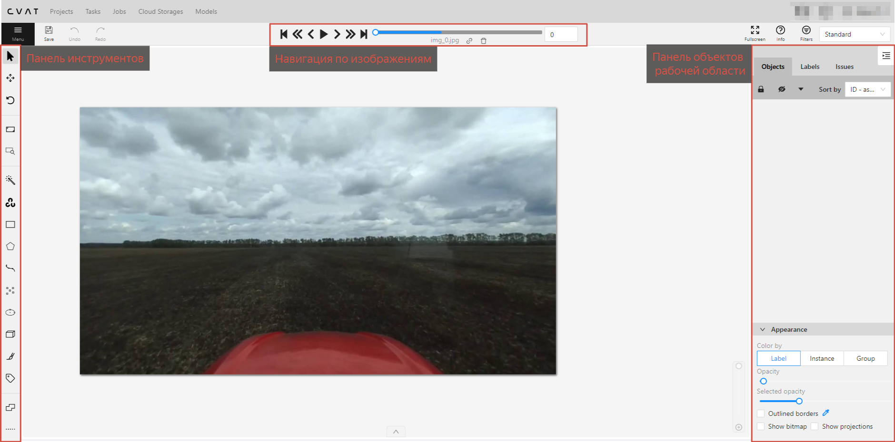{width="5.623433945756781in"
height="2.7771259842519687in"}

Рисунок 11. Обзор интерфейса редактора

Теперь необходимо провести разметку всех 140 изображений (Рис. 12).
Качество разметки напрямую влияет на эффективность модели в определении
целевого объекта. Чем более точно будет выполнена разметка изображения,
тем более точно модель сможет выявлять необходимый объект.

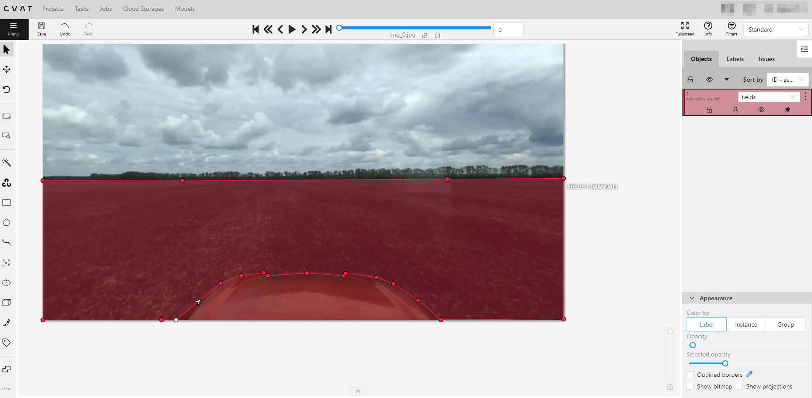

Рисунок 12. Пример разметки изображения

После разметки всех изображений сохраните их, нажав на \"Save\" в
верхней панели. Перейдите в раздел \"Task\" (Рис. 13).

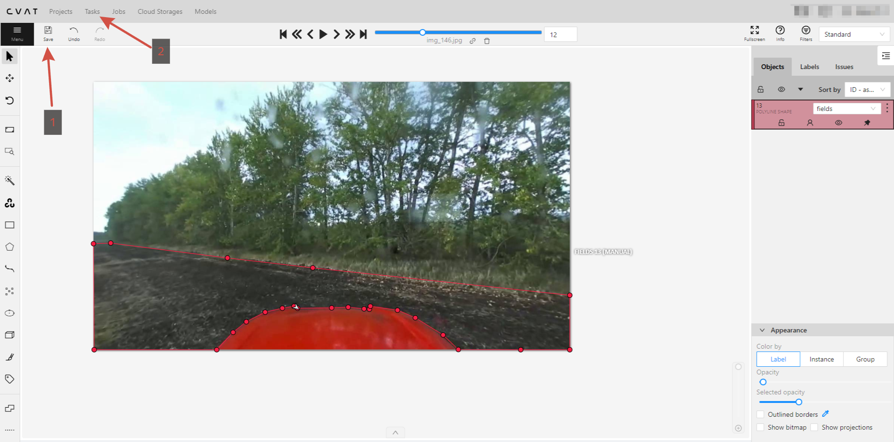

Рисунок 13. Сохранение размеченных изображений

Выберите \"Actions\" -\\"Export task dataset\", выберите формат
экспорта \"Segmentation mask 1.1\", укажите название файла и подтвердите
выбор \"OK\" (Рис. 14).

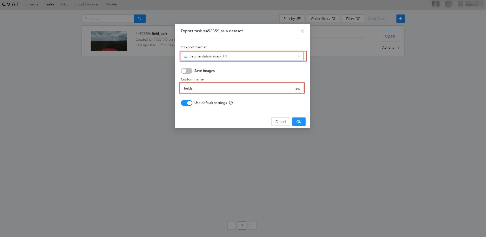

Рисунок 14. Экспорт разметки

## Преобразования и разделения набора данных

Создайте в проекте YOLOv8 папку \"tmp\" с подпапками \"labels\",
\"masks\" и \"images\". Перенесите маски экспортированных разметок из
папки \"SegmentationClass\" в подпапку \"masks\", а изображения из
используемого для разметки набора данных в подпапку \"images\".
Убедитесь, что названия масок совпадают с названиями изображений
(Рис.15).\
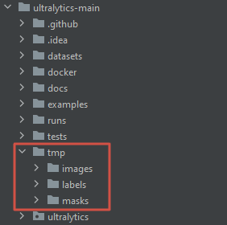

Рисунок 15. Создание папок \"labels\", \"masks\" и \"images\"

После экспорта набора данных с метками, необходимо преобразовать эти
маски в полигоны, создав Python-скрипт с соответствующим кодом. Укажите
пути к папкам \"masks\" и \"labels\" в переменные \"input\_dir\" и
\"output\_dir\" соответственно, а затем запустите код (Листинг 1).

Листинг 1. Код преобразование изображений меток в полигоны

```python
import os

import cv2

input_dir = './tmp/masks'
output_dir = './tmp/labels'

for j in os.listdir(input_dir):
    image_path = os.path.join(input_dir, j)
    # load the binary mask and get its contours
    mask = cv2.imread(image_path, cv2.IMREAD_GRAYSCALE)
    _, mask = cv2.threshold(mask, 1, 255, cv2.THRESH_BINARY)

    H, W = mask.shape
    contours, hierarchy = cv2.findContours(mask, cv2.RETR_EXTERNAL, cv2.CHAIN_APPROX_SIMPLE)

    polygons = []
    for cnt in contours:
        if cv2.contourArea(cnt) > 200:
            polygon = []
            for point in cnt:
                x, y = point[0]
                polygon.append(x / W)
                polygon.append(y / H)
            polygons.append(polygon)

    with open('{}.txt'.format(os.path.join(output_dir, j)[:-4]), 'w') as f:
        for polygon in polygons:
            for p_, p in enumerate(polygon):
                if p_ == len(polygon) - 1:
                    f.write('{}\n'.format(p))
                elif p_ == 0:
                    f.write('0 {} '.format(p))
                else:
                    f.write('{} '.format(p))

        f.close()
```

После завершения предыдущего шага, в папке \"labels\" появятся метки в
формате txt.

Теперь разделите метки и изображения на тренировочную и валидационную
выборки, создав внутри папок \"masks\" и \"images\" подпапки \"train\" и
\"val\". Рекомендуется использовать 70% данных для обучения и 30% для
валидации (Рис.16).

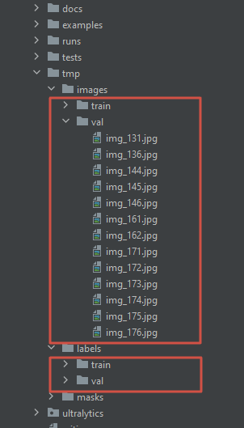

Рисунок 16. Разделение на тренировочную и валидационную выборку.

# Обучение модели

Переходим к этапу обучения модели.

## Настройка конфигурационного файла 

После разделения набора данных требуется настройка конфигурационного
файла (Листинг 2). Укажите путь к папке, содержащей подпапки \"images\"
и \"labels\", и определите название класса (в данном случае -
\"field\").

Листинг 2. Конфигурационный файл
```yaml
path:/tmp
train: images/train
val: images/val

nc: 1

names: ['field']
```

## Тренировка модели

Теперь создайте в корневой папке Python-файл, который будет
использоваться для обучения (Листинг 3). Укажите модель для обучения (в
данном примере выбрана \"yolov8n-seg.pt\"). Затем определите
конфигурационный файл, количество эпох обучения, размеры изображений и
устройство для вычислений - процессор или видеокарта. Начните процесс
обучения с использованием метода train. В данном примере обучение
проводится на 10 эпохах.

Листинг 3. Код для тренировки модели

```python
from ultralytics import YOLO

if __name__ == '__main__' :
    model = YOLO('yolov8n-seg.pt')

    model.train(data='config.yaml', epochs=10, imgsz=640, device="cpu")
```

## Описание выходных данных

После завершения обучения появится папка \"train\*\", содержащая
выходные данные модели YOLOv8, включающие несколько компонентов, которые
представляют результаты обучения и производительность модели. Эти
компоненты включают:

-   Веса модели - это файлы, содержащие параметры модели, которые
    определяют ее поведение. В папке с весами модели YOLOv8 обычно
    находятся два файла: \"last.pt\" и \"best.pt\". Файл \"last.pt\"
    содержит веса модели, полученные после завершения всех эпох
    обучения. Файл \"best.pt\" содержит веса обученной нейронной сети,
    соответствующие эпохе с наименьшей ошибкой распознавания. Веса
    модели могут быть использованы для применения модели к новым
    изображениям с помощью камеры комбайна и вывода маски границ поля.

-   Метрики обучения - это значения, которые отражают, насколько хорошо
    модель обучается на тренировочных и валидационных данных. Метрики
    обучения могут включать потери (loss), точность (precision),
    полноту (recall), F1-меру (F1-score) и другие. Они используются
    для оценки качества модели, сравнения разных моделей и контроля
    процесса обучения.

-   Графики обучения - это визуализации, которые показывают изменение
    метрик обучения в течение эпох или итераций. Графики обучения
    могут быть представлены в виде кривых, диаграмм или графиков, и
    помогают визуально оценить процесс обучения. Они могут также
    помочь выявить проблемы, такие как переобучение или недообучение
    модели.

-   Примеры вывода - это изображения, на которых модель показывает свои
    результаты обнаружения границ поля. Эти примеры вывода могут быть
    использованы для проверки реальной работоспособности модели и ее
    точности на различных сценах. Они представляют собой визуальные
    примеры того, как модель определяет и отмечает границы полей на
    изображениях комбайна.

Эти выходные данные помогают в оценке и анализе производительности
модели YOLOv8, а также в проверке ее работоспособности на новых данных и
сценах. Они представляют информацию о параметрах модели, метриках
обучения, графиках обучения и визуальные примеры ее работы.

## Тестирование модели

Теперь проведем анализ эффективности модели в определении объектов на
видео. Создадим Python-скрипт для прогнозирования объектов на видео или
изображении. В новом файле необходимо указать путь к весам обученной
модели и использовать метод predict (Листинг 4).

Листинг 4. Код для предсказания объекта, используя обученную модель

```python
from ultralytics import YOLO

model = YOLO("last.pt")

test = model.predict(source='test1.mp4', save=True, show=True)
```

В результате получим видео, из которого можно сделать вывод о том, что
модель демонстрирует недостаточно высокую точность в определении
сельскохозяйственных полей (Рисунок 17). Этот вывод позволяет
предположить, что модель не достигла необходимого уровня обучения, и
рекомендуется продолжить процесс обучения.

{width="6.267716535433071in"
height="3.5277777777777777in"}

Рисунок 17. Тестирование обученной модели

Продолжение обучения модели
---------------------------

Для продолжения обучения, с целью избежать повторного обучения модели,
мы можем воспользоваться ранее обученной моделью с 10 эпохами и
дополнительно провести обучение, добавив необходимое количество эпох.
Для этого достаточно внести изменения, добавив метод load при создании
объекта модели и указав веса предыдущей обученной модели. После этого
увеличиваем количество эпох, например, до 50 (Листинг 5).

Листинг 5. Код для продолжения обучения модели

+-------------------------------------------------------------------------+
| from ultralytics import YOLO                                            |
|                                                                         |
| if \_\_name\_\_ == \'\_\_main\_\_\' :                                   |
|                                                                         |
| model = YOLO(\'yolov8n-seg.pt\').load(\'last.pt\')                      |
|                                                                         |
| model.train(data=\'config.yaml\', epochs=50, imgsz=640, device=\"cpu\") |
+-------------------------------------------------------------------------+

Тестирование дообученной модели
-------------------------------

Также, получены выходные данные, сохраненные в папке \"train\*\".
Произведем повторное прогнозирование на том же видео, которое
использовалось для недостаточно обученной модели (Рисунок 18).


Рисунок 18. Тестирование модели после продолжения обучения

Результат значительно улучшился. Модель эффективно определяет
сельскохозяйственные поля, хотя не безупречно. Заметно, что при повороте
сельскохозяйственной техники модель начала классифицировать часть
деревьев как поле. Это явление обусловлено низким качеством
использованных изображений и ограниченным объемом данных. Для
преодоления данной проблемы можно попытаться увеличить количество эпох
обучения (с учетом осторожности, чтобы избежать переобучения модели),
использовать изображения более высокого качества и расширить объем
доступных данных.\
В рамках обучения использования модели YOLOv8, полученные результаты
будут приемлемыми.

 

# Дальнейшиие шаги

Дальнейшие шаги включают в себя оптимизацию параметров обучения,
улучшение качества изображений в обучающем наборе, а также рассмотрение
методов расширения данных. Эти улучшения могут существенно повысить
обобщающую способность модели и улучшить ее способность к адаптации к
различным сценариям сельскохозяйственной деятельности.

В целом, использование модели YOLOv8 предоставляет перспективное решение
для задачи распознавания объектов в сельском хозяйстве, и дальнейшая
работа в направлении улучшения модели может привести к более точным и
устойчивым результатам.
